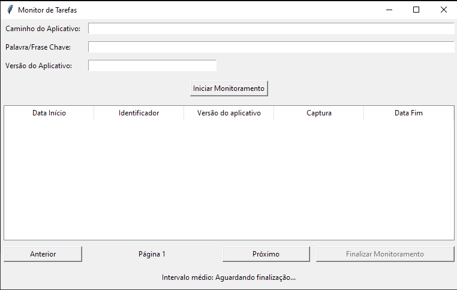
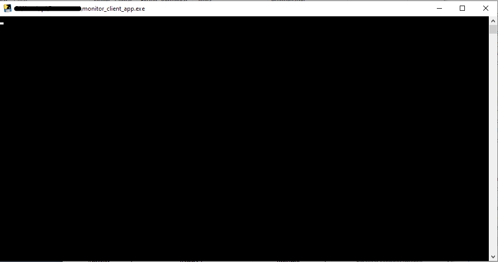

# Monitor de log de Prompt de Comando

[](https://opensource.org/licenses/MIT)
[](#status-do-projeto)
[](https://www.python.org/)
[](#requirements.txt)

> Aplicativo criado para captura de dados de log em tempo real executado através do prompt de comando


[](CODE_OF_CONDUCT.md)
[](CONTRIBUTING.md)

## Visão Geral do projeto

A criação deste aplicativo surgiu na necessidade de monitorar uma determindata tarefa de um serviço e validar se está sendo executado dentro do tempo programado. O serviço pode ser executado via prompt de comando e ser visualizada todas as tarefas que estão sendo realizadas. Com o aplicativo é possível capturar palavra ou frase de até 80 caracteres e obter a linha em que esta CHAVE (palavra ou frase) aparece. 

As linha em que contém esta CHAVE são mostradas no aplicativo com data e hora de finalização. Ao clicar em Finalizar Monitoramento e informado o calculo de tempo médio em que esta tarefa estava sendo executada e salvo um log.txt para analise futura ou utilizado como evidência.


### Pré-requisitos

Liste aqui as dependências que precisam ser instaladas antes de executar o projeto. Inclua links para download, se aplicável.

* [Python](https://www.python.org/downloads/) (versão 3.11 ou superior)
* [pip](https://pip.pypa.io/en/stable/installing/) (geralmente instalado com o Python)
* [Git](https://git-scm.com/downloads) (para clonar o repositório)

### Instalação

Passos para instalar o projeto e suas dependências.

1.  Clone o repositório:
    ```bash
    git clone [https://github.com/CamilaSantos/monitor_log_cmd.git](https://github.com/CamilaSantos/monitor_log_cmd.git)
    cd seu-repositorio
    ```

2.  Crie e ative um ambiente virtual (recomendado):
    ```bash
    python -m venv venv
    .\venv\Scripts\activate  # No Windows
    ```

3.  Instale as dependências:
    ```bash
    pip install -r requirements.txt
    ```

## Execução

### Gerando o Executável com PyInstaller

Este projeto utiliza o [PyInstaller](https://www.pyinstaller.org/) para gerar um executável independente. Siga os passos abaixo para criar o seu próprio executável:

1.  **Navegue até o diretório raiz do seu projeto** no terminal (onde o arquivo `monitor_log_cmd.py` está localizado).

2.  **Execute o comando do PyInstaller.** O comando básico para gerar um único arquivo executável é:

    ```bash
    pyinstaller --onefile monitor_log_cmd.py
    ```

    * `pyinstaller`: É o comando para executar o PyInstaller.
    * `--onefile`: Esta opção instrui o PyInstaller a gerar um único arquivo executável. Se você omitir esta opção, o PyInstaller criará um diretório `dist` contendo o executável e outras bibliotecas necessárias.
    * `monitor_log_cmd.py`: Substitua este pelo nome do arquivo principal do seu projeto Python.

3.  **Aguarde a conclusão do processo.** O PyInstaller analisará seu script, coletará as dependências e criará o executável. Este processo pode levar algum tempo, dependendo do tamanho e das dependências do seu projeto.

4.  **Verifique a pasta `dist`.** Após a conclusão, o executável gerado estará localizado dentro de uma pasta chamada `dist` que será criada no diretório raiz do seu projeto.

    * Se você usou a opção `--onefile`, o arquivo executável estará diretamente dentro da pasta `dist`.
    * Se você não usou `--onefile`, a pasta `dist` conterá o executável e outras pastas e arquivos necessários para executá-lo.


### Executando o Aplicativo Gerado

Após a geração, você pode simplesmente executar o arquivo executável (localizado na pasta `dist`) para rodar o seu aplicativo sem precisar ter o Python instalado no sistema em que ele está sendo executado (embora algumas dependências do sistema operacional ainda possam ser necessárias). Este executável pode ser incluído em qualquer outra pasta que desejar.

**Principais Recursos:**

* Recurso 1: Aceita qualquer dado de entrada (Palavra, frase, números...), limitados a 80 caracteres.
* Recurso 2: Apenas informar o caminho do arquivo ao qual deseja monitorar. (Funciona apenas com executáveis com tela de prompt de comando).
* Recurso 3: Data e hora em que foi localizada a linha com CHAVE informada, capturada a linha com a CHAVE, data e hora em que finalizou.
* Recurso 4: Ao finalizar através do botão "Finalizar Monitoramento", o registro fica salvo no log.txt
* Recurso 5: É realizado o calculo médio de quanto em quanto tempo esta CHAVE apareceu.

## Tela da aplicação
Tela 1: Entrada de dados


Tela 2: Executa prompt de comando, visualização do executável informado



**Observação:** A primeira vez que você executa o aplicativo gerado pelo PyInstaller, ele pode levar um pouco mais de tempo para iniciar, pois precisa extrair os arquivos necessários para uma pasta temporária. As execuções subsequentes geralmente são mais rápidas.


## Contribuição

Quer contribuir? Dê uma olhada no nosso [Guia de Contribuição](CONTRIBUTING.md) para começar!

## Código de Conduta

Nosso compromisso com um ambiente aberto e acolhedor é detalhado no nosso [Código de Conduta](CODE_OF_CONDUCT.md).

## Autores

* **Camila Santos (CS)** - *Criador e Desenvolvedor Principal* - [https://github.com/CamilaSantos](https://github.com/CamilaSantos)
    > Responsável pela arquitetura do projeto, desenvolvimento dos principais módulos e manutenção geral.